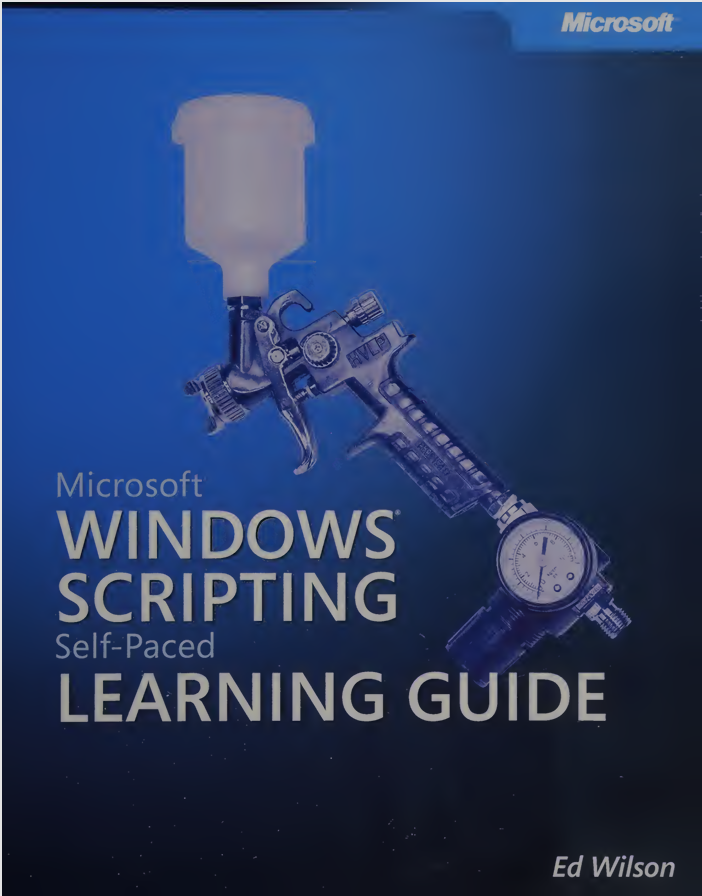
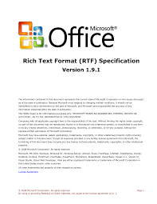
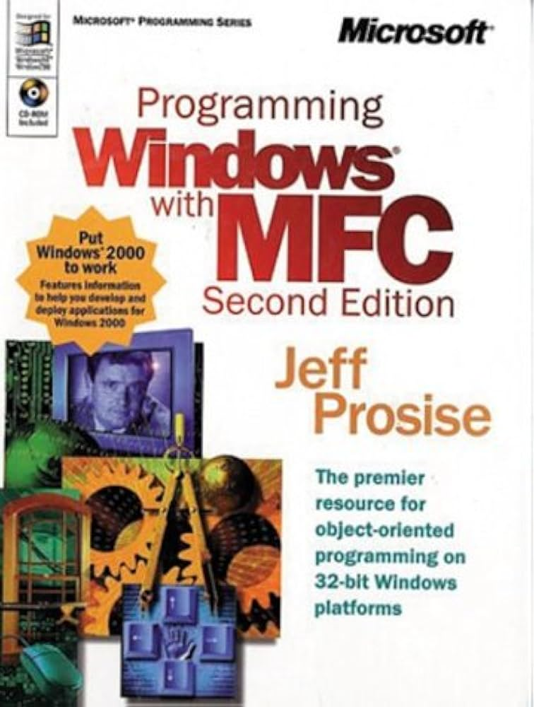
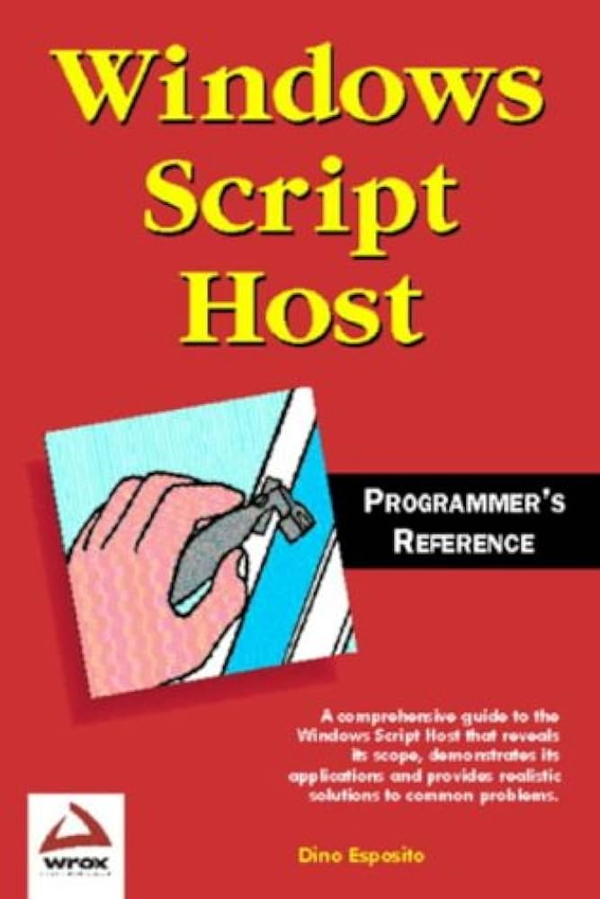
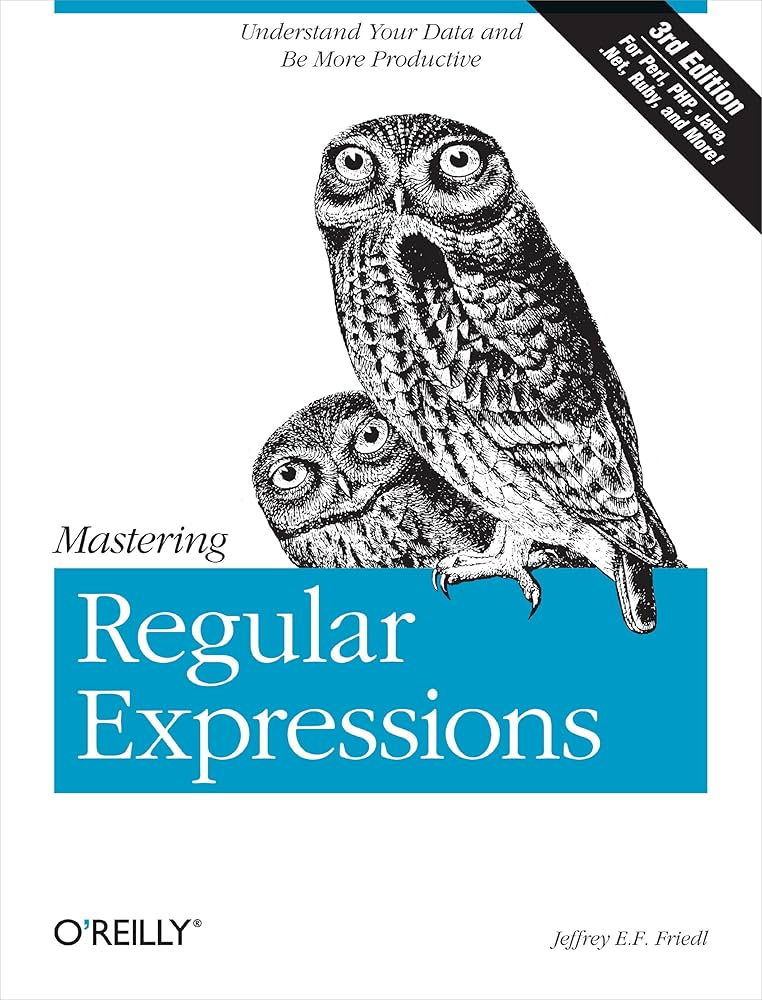

# tabinator
A jscript application for editing .rtf and saving .pdf guitar tabs

Use arrow keys and numbers or predefined symbols to edit and save guitar and bass tabs

Books Used
 
 <!-- ROW 1 IMAGES -->

  

  

  

 
<!-- ROW 1 TEXT -->

  <strong>Microsoft Windows scripting self-paced learning guide</strong>

  <strong>RTF Specification (Microsoft, 1997)</strong>

  <strong>Inside OLE — Kraig Brockschmidt (1997)</strong>

<!-- SPACE BETWEEN ROWS -->

<!-- ROW 2 IMAGES -->

  

  

  

 
<!-- ROW 2 TEXT -->

  <strong>Programming Windows with MFC — Jeff Prosise</strong>

  <strong>Windows Script Host Programmer's Reference — Dino Esposito</strong>

  <strong>Mastering Regular Expressions — Jeffrey Friedl</strong>

